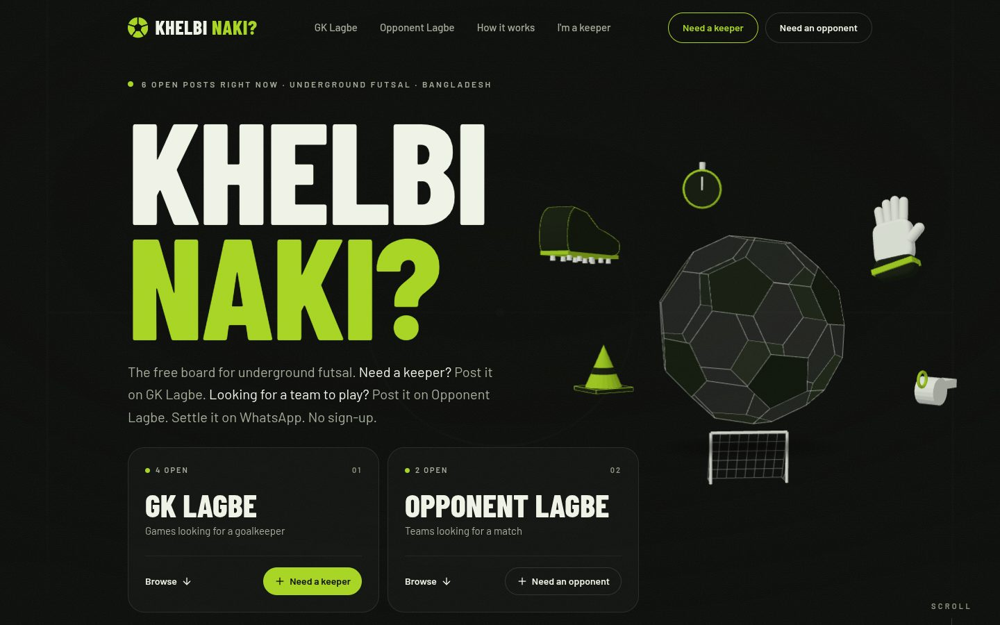
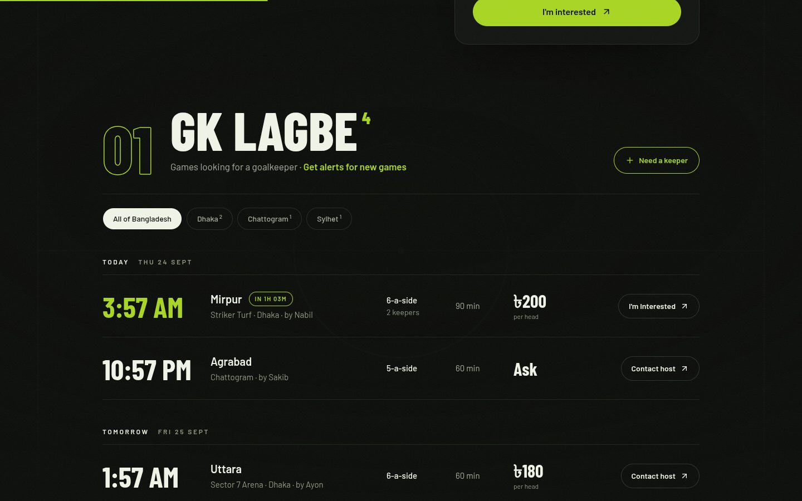
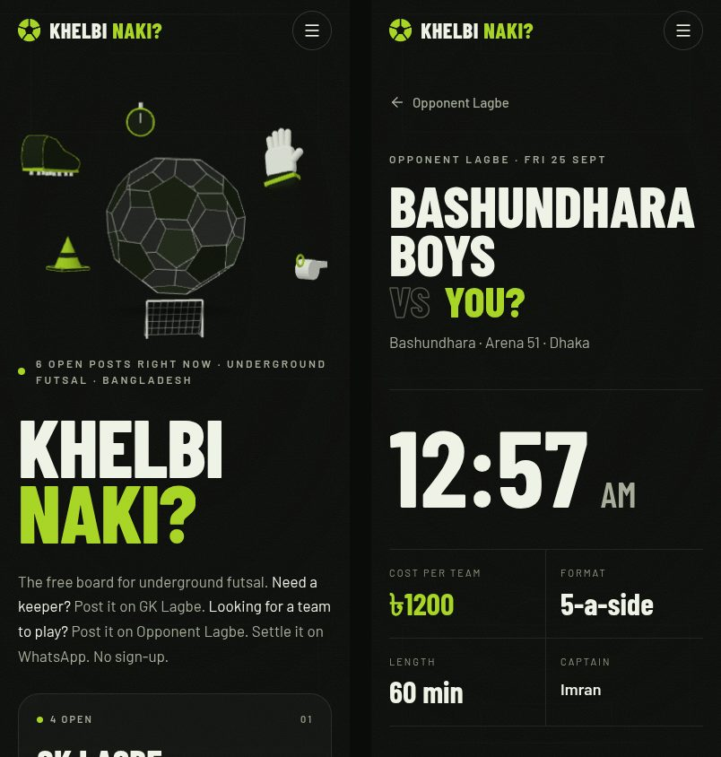
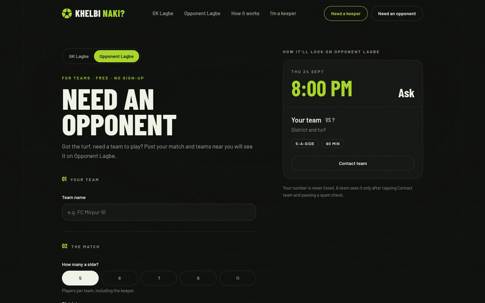

<p align="center">
  
</p>

<h1 align="center">Khelbi Naki?</h1>

<p align="center">
  <b>The free board for underground futsal in Bangladesh.</b><br />
  Short a goalkeeper? Need a team to play? Post it in thirty seconds and settle it on WhatsApp.
</p>

<p align="center">
  <a href="https://khelbinaki.zlabz.workers.dev"><b>khelbinaki.zlabz.workers.dev</b></a>
  &nbsp;·&nbsp; no sign-up &nbsp;·&nbsp; no fees &nbsp;·&nbsp; no ads
</p>

<p align="center">
  
</p>

## Two boards

| | **GK Lagbe** | **Opponent Lagbe** |
|---|---|---|
| Who posts | A host whose game is short a goalkeeper | A team that has the turf and needs a team to play |
| What they say | Turf, kick-off, 5/6/7/8/11-a-side, cost **per head**, keepers needed | Team name, turf, kick-off, how many a side, cost **per team** |
| Who answers | Keepers | Other teams |

Posts are grouped by day in Bangladesh time and filtered by district. A post leaves
the board by itself at kick-off.

<p align="center">
  
</p>

## How it works

1. **Post the gap.** Pick a district, the area and turf, the time, how many a side and
   the cost. No account — you get a private manage link instead.
2. **Players find you.** Keepers browse GK Lagbe, teams browse Opponent Lagbe. Keepers
   can get a browser notification or a Telegram message (@gklagbebot) when a game
   near them needs a keeper.
3. **Settle it on WhatsApp.** You choose how people reach you:
   - **Message me** — they tap *Contact host*, pass a quick spam check, and see your
     number for WhatsApp or a call.
   - **Send me your number** — your number stays private; they leave theirs, and only
     you see the list on your manage page.

   Mark the post filled when you're sorted.

<p align="center">
  
</p>

## Privacy, by design

- **No accounts.** A host's post is controlled by its private manage link. A keeper's
  profile lives only in their own browser.
- **Numbers are never listed on the board.** A host's number is shown only to someone
  who taps Contact and passes the spam check — or to nobody, in "send me your number" mode.
- **Data doesn't pile up.** An hourly job archives a post when its match ends and
  deletes it, together with any numbers sent to it, 48 hours later.

## Built on free tiers

The whole thing runs inside one free Cloudflare account — the project makes no money
and costs nothing to run.

| Part | Tech |
|---|---|
| Site | Vite + React 19, Tailwind 4, Motion, Lenis smooth scroll, three.js hero — served by a Cloudflare Worker that also writes per-post link previews |
| API | Cloudflare Workers + Hono |
| Database | Cloudflare D1 (SQLite) |
| Spam checks | Cloudflare Turnstile |
| Alerts | Web Push (VAPID) and a Telegram bot |
| Cleanup | Cloudflare Cron Trigger, hourly |

<p align="center">
  
</p>

## Run it locally

You need Node 22 (`nvm use` picks it up from `.nvmrc`).

```bash
# API on http://localhost:8787
cd api
npm install
npx wrangler d1 migrations apply khelbinaki-db --local
npx wrangler d1 execute khelbinaki-db --local --file=seed/dev.sql   # demo games
npm run dev

# Site on http://localhost:5173 (talks to the local API)
cd web
npm install
npm run dev
```

Tests:

```bash
cd api && npm test   # runs in the real Workers runtime against a local D1
cd web && npm test
```

## Deploy

- **Site:** pushes to `main` deploy automatically (Cloudflare Workers Builds).
- **API:** apply any new migrations first, then deploy:

  ```bash
  cd api
  npx wrangler d1 migrations apply khelbinaki-db --remote
  npm run deploy
  ```

## Project layout

```
api/            Worker API (Hono), D1 migrations, hourly cleanup, alerts
  src/app.ts      routes
  src/cleanup.ts  archive + delete schedule
web/            React site + the Worker that serves it
  src/lib/listing.ts   all GK Lagbe / Opponent Lagbe wording in one place
  src/components/hero/ the three.js football scene
docs/           design specs and implementation plans
CLAUDE.md       project rules for contributors and AI assistants
```

## Ideas and bugs

Something missing on the board? [Open an issue](https://github.com/TIZadid/khelbinaki/issues).
And if Khelbi Naki found you a keeper, you can [buy me a cha](https://khelbinaki.zlabz.workers.dev/cha). ☕
